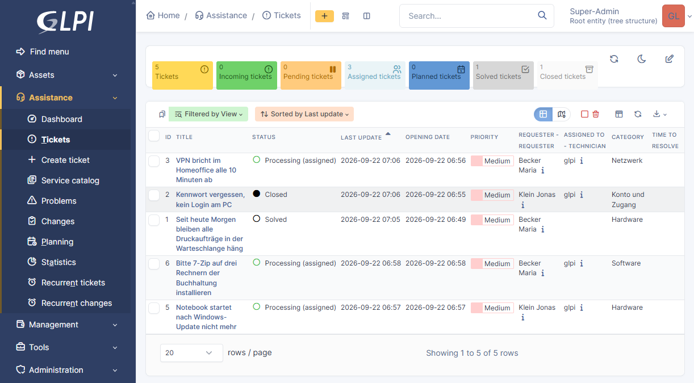
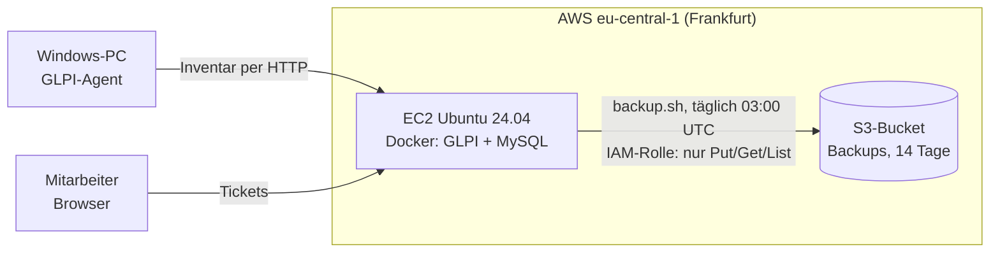
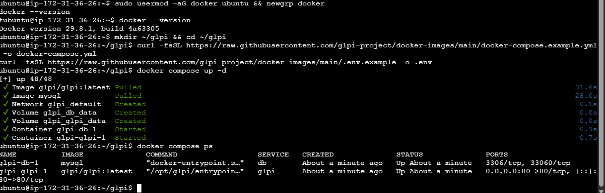
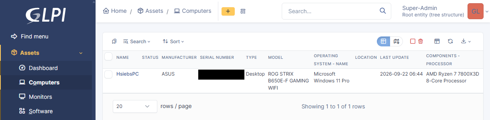
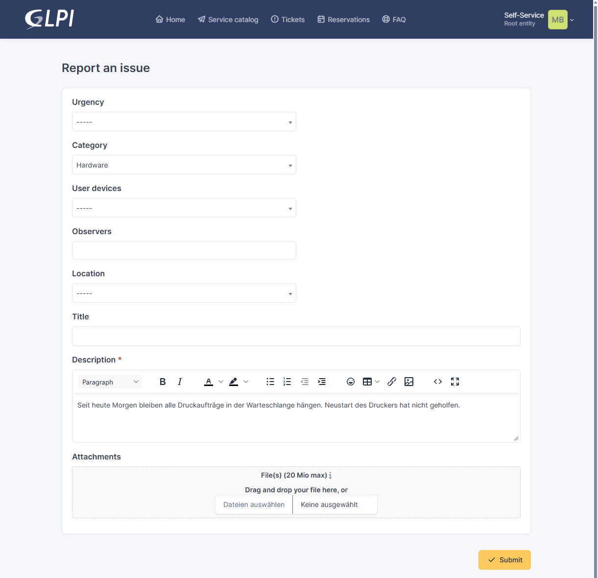
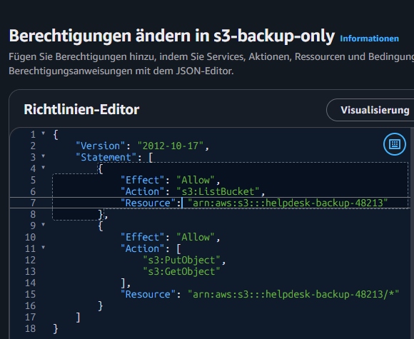
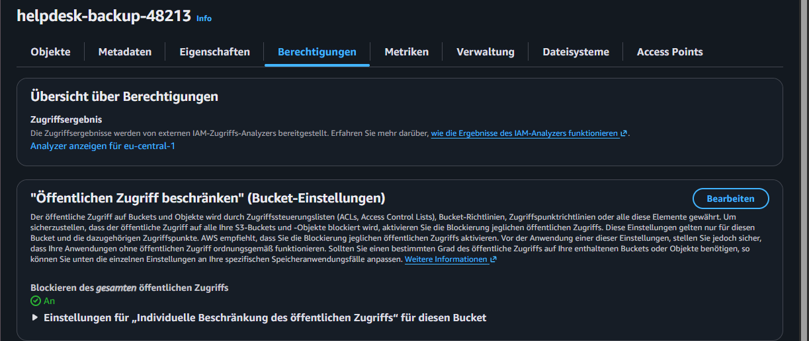
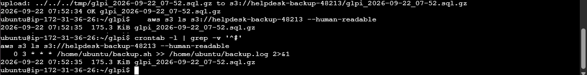
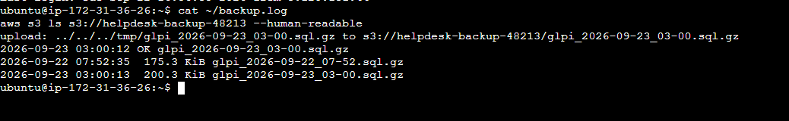
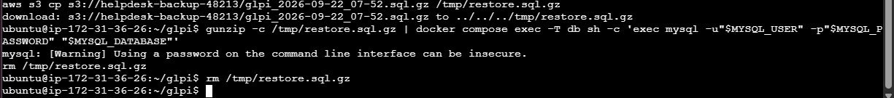

# IT-Helpdesk in der Cloud

Ticketsystem, Inventarisierung und automatisches Offsite-Backup für eine fiktive
**Musterfirma GmbH**, aufgebaut auf AWS mit GLPI und Docker.
Mit getesteter Wiederherstellung: Ticket gelöscht, aus dem Backup zurückgeholt.



## Was das Projekt zeigt

| Aufgabe im IT-Alltag | Umsetzung |
|---|---|
| IT-Systeme einrichten | Linux-Server auf AWS EC2, Firewall-Regeln, Docker |
| Programme installieren | GLPI und MySQL per Docker Compose, GLPI-Agent auf einem Windows-PC |
| Anwender unterstützen | Ticketsystem mit Kategorien, Mitarbeiterkonten und Self-Service |
| Hardware verwalten | Automatische Inventarisierung von Hardware und Software |
| Daten sichern und wiederherstellen | Nächtliches Backup nach Amazon S3, Restore-Test |
| Rechte vergeben | IAM-Rolle nach dem Prinzip Least Privilege, kein Zugangsschlüssel auf dem Server |

## Aufbau



| Teil | Details |
|---|---|
| Server | AWS EC2, Ubuntu 24.04, t3.small, 20 GB gp3, Region Frankfurt |
| Firewall | SSH nur mit Schlüssel, HTTP nur von einer freigegebenen IP |
| Software | Docker, Docker Compose, offizielles Image `glpi/glpi`, MySQL |
| Backup | S3-Bucket, öffentlicher Zugriff blockiert, Lebenszyklusregel löscht nach 14 Tagen |
| Rechte | IAM-Rolle an der Instanz, darf Backups schreiben und lesen, aber nicht löschen |

## Umsetzung

### 1. Server und GLPI

EC2-Instanz angelegt, Docker installiert, GLPI mit MySQL per Docker Compose gestartet.
Die Standardkennwörter aller vier GLPI-Konten wurden sofort geändert.



### 2. Firma, Benutzer, Inventar, Tickets

- Ticketkategorien: Hardware, Netzwerk, Konto und Zugang, Software
- Zwei Mitarbeiterkonten mit dem Profil Self-Service
- GLPI-Agent auf einem Windows-PC meldet Hardware und installierte Software automatisch
- Fünf Tickets (Drucker, Kennwort, VPN, Notebook, Softwarewunsch) als Incident und Request, in verschiedenen Zuständen

**Inventar:** Der GLPI-Agent hat den PC mit Hersteller, Modell, Betriebssystem und Prozessor selbst gemeldet.



**Self-Service:** So meldet eine Mitarbeiterin ein Problem, ohne Zugriff auf die Technik-Ansicht.



### 3. Backup und Wiederherstellung

Jede Nacht wird die Datenbank exportiert, komprimiert und nach S3 hochgeladen.

**Rechte des Servers** (Inline-Richtlinie der IAM-Rolle):

```json
{
  "Version": "2012-10-17",
  "Statement": [
    { "Effect": "Allow", "Action": "s3:ListBucket", "Resource": "arn:aws:s3:::BUCKET" },
    { "Effect": "Allow", "Action": ["s3:PutObject", "s3:GetObject"], "Resource": "arn:aws:s3:::BUCKET/*" }
  ]
}
```



Kein `DeleteObject`: Selbst wer den Server übernimmt, kann die Backups nicht löschen.
Alte Backups räumt nur die Lebenszyklusregel des Buckets weg.

**Backup-Skript** (`backup.sh`, per Cron täglich um 03:00 UTC):

```bash
#!/bin/bash
set -euo pipefail
export PATH="$PATH:/snap/bin"
cd ~/glpi

BUCKET="s3://BUCKET"
FILE="glpi_$(date +%F_%H-%M).sql.gz"

set -a; source .env; set +a
# mysqldump 8.4 statt 9.x: 9.x will Masking-Policies sichern und braucht dafür Root-Rechte
docker run --rm --network glpi_default -e MYSQL_PWD="$GLPI_DB_PASSWORD" mysql:8.4 \
  mysqldump -h "$GLPI_DB_HOST" -u "$GLPI_DB_USER" --no-tablespaces --set-gtid-purged=OFF "$GLPI_DB_NAME" | gzip > "/tmp/$FILE"
aws s3 cp "/tmp/$FILE" "$BUCKET/$FILE"
rm "/tmp/$FILE"
echo "$(date '+%F %T') OK $FILE"
```

Kein Kennwort im Skript: Die Zugangsdaten kommen aus der `.env` von Docker Compose.
`set -euo pipefail` sorgt dafür, dass ein fehlgeschlagener Export nicht als leere Datei hochgeladen wird.



Erster Lauf von Hand, Cron-Eintrag und Datei in S3:



Nachweis am nächsten Morgen, der Cron-Job hat um 03:00 UTC selbst gesichert:



**Restore-Test:** Ein gelöstes Ticket wurde endgültig gelöscht und aus dem Backup zurückgeholt.

```bash
aws s3 cp s3://BUCKET/glpi_DATUM.sql.gz /tmp/restore.sql.gz
gunzip -c /tmp/restore.sql.gz | docker compose exec -T db sh -c 'exec mysql -u"$MYSQL_USER" -p"$MYSQL_PASSWORD" "$MYSQL_DATABASE"'
```



Danach waren alle fünf Tickets wieder da (Bild ganz oben).

## Probleme und Lösungen

| Problem | Ursache | Lösung |
|---|---|---|
| EC2 Instance Connect verbindet nicht | SSH war nur für die eigene IP offen, die Browser-Verbindung kommt aber von AWS-Servern | SSH geöffnet, Anmeldung weiterhin nur per Schlüssel |
| GLPI-Agent meldet nichts | Server-URL im Feld "Local target" (das ist ein Ordner) | URL unter "Remote targets": `http://SERVER/front/inventory.php` |
| Ticketkategorien nicht auffindbar | In GLPI 11 sind Dropdowns als Kacheln gruppiert | Kachel Assistance, `/front/itilcategory.php` |
| `mysqldump` bricht ab (RELOAD) | `--single-transaction` braucht ein Recht, das der GLPI-Datenbankbenutzer nicht hat | Option weggelassen |
| `mysqldump` bricht ab (Masking-Policies) | mysqldump aus MySQL 9 will Masking-Policies mitsichern und braucht dafür Root | Export mit mysqldump 8.4 aus einem Wegwerf-Container im selben Docker-Netz, dazu `--set-gtid-purged=OFF` |
| Restore scheinbar ohne Wirkung | Ticketliste stand noch in der Papierkorb-Ansicht | Ansicht gewechselt, alle Tickets waren wieder da |

## Bewusst weggelassen

- Kein HTTPS und keine Domain: Testumgebung, nur für eine IP erreichbar
- Keine E-Mail-Anbindung an GLPI
- Das Datei-Volume von GLPI wird nicht gesichert, weil keine Dokumente hochgeladen wurden. In einer echten Umgebung käme es als zweites Backup dazu.

## Kosten

Wenige Euro im Monat bei laufender Instanz. Wird der Server nicht gebraucht, wird er gestoppt.

---

Hsieb Nazar · Informatikstudent, Bewerber für die Ausbildung Fachinformatiker Systemintegration
