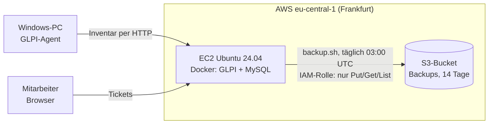

# IT-Helpdesk in der Cloud

In diesem Projekt habe ich einen kleinen IT-Helpdesk für die fiktive Musterfirma GmbH aufgebaut. Er läuft auf einem Linux-Server bei AWS, nutzt das Ticketsystem GLPI und sichert seine Datenbank jede Nacht automatisch in die Cloud. Dass die Sicherung auch im Ernstfall funktioniert, habe ich getestet: Ich habe ein Ticket endgültig gelöscht und es aus dem Backup wiederhergestellt.


## Was ich umgesetzt habe

| Aufgabe | Wie ich sie gelöst habe |
|---|---|
| IT-System einrichten | Linux-Server auf AWS EC2 mit eigenen Firewall-Regeln und Docker |
| Programme installieren | GLPI und MySQL über Docker Compose, dazu der GLPI-Agent auf einem Windows-PC |
| Anwender unterstützen | Ticketsystem mit Kategorien, Mitarbeiterkonten und Self-Service-Portal |
| Hardware verwalten | Hardware und Software werden automatisch inventarisiert |
| Daten sichern und wiederherstellen | Nächtliches Backup nach Amazon S3, Wiederherstellung getestet |
| Rechte vergeben | IAM-Rolle mit so wenig Rechten wie möglich, kein Zugangsschlüssel auf dem Server |

## Aufbau

Alles läuft in der AWS-Region Frankfurt. Der Server schreibt seine Backups über eine IAM-Rolle in einen S3-Bucket, einen gespeicherten Zugangsschlüssel gibt es dafür nicht.



| Teil | Details |
|---|---|
| Server | AWS EC2, Ubuntu 24.04, t3.small, 20 GB gp3, Region Frankfurt |
| Firewall | SSH nur mit Schlüssel, HTTP nur von einer freigegebenen IP |
| Software | Docker, Docker Compose, offizielles Image `glpi/glpi`, MySQL |
| Backup | S3-Bucket ohne öffentlichen Zugriff, alte Backups werden nach 14 Tagen gelöscht |
| Rechte | IAM-Rolle an der Instanz, darf Backups schreiben und lesen, aber nicht löschen |

## Umsetzung

### 1. Server und GLPI

Zuerst habe ich eine EC2-Instanz mit Ubuntu 24.04 angelegt und Docker installiert. GLPI und die MySQL-Datenbank laufen als zwei Container, die ich mit Docker Compose starte. Direkt nach der Installation habe ich die Standardkennwörter aller vier GLPI-Konten geändert, denn sonst wäre das System mit allgemein bekannten Zugangsdaten erreichbar gewesen.


### 2. Firma, Benutzer, Inventar und Tickets

Danach habe ich GLPI so eingerichtet, wie es eine kleine Firma im Alltag braucht. Es gibt vier Ticketkategorien (Hardware, Netzwerk, Konto und Zugang, Software) und zwei Mitarbeiterkonten mit dem Profil Self-Service.

Auf meinem Windows-PC habe ich den GLPI-Agent installiert. Er meldet Hardware und installierte Software selbstständig an den Server, ich musste den PC also nicht von Hand erfassen. Im Inventar steht er mit Hersteller, Modell, Betriebssystem und Prozessor:


Mitarbeiter melden ihre Probleme über das Self-Service-Portal. Hier trägt Maria Becker ein Druckerproblem ein. Sie sieht dabei nur das Portal und nicht die Ansicht, mit der der Support arbeitet:


Insgesamt habe ich fünf Tickets angelegt, darunter einen Drucker, der nicht mehr druckt, ein vergessenes Kennwort und einen Softwarewunsch. Ein Teil davon sind Incidents, also Störungen. Der Rest sind Requests, bei denen jemand etwas Neues braucht. Die Tickets stehen in unterschiedlichen Zuständen, damit die Liste so aussieht wie im echten Betrieb.

### 3. Backup und Wiederherstellung

Jede Nacht um 03:00 UTC exportiert ein Skript die Datenbank, packt sie mit gzip und lädt sie in einen S3-Bucket. Der Bucket ist für öffentliche Zugriffe komplett gesperrt. Eine Lebenszyklusregel löscht Backups, die älter als 14 Tage sind.


Damit der Server überhaupt in den Bucket schreiben darf, hängt an der Instanz eine IAM-Rolle. Ihre Richtlinie erlaubt genau drei Aktionen: Inhalt auflisten, Dateien hochladen und Dateien herunterladen.

```json
{
  "Version": "2012-10-17",
  "Statement": [
    { "Effect": "Allow", "Action": "s3:ListBucket", "Resource": "arn:aws:s3:::BUCKET" },
    { "Effect": "Allow", "Action": ["s3:PutObject", "s3:GetObject"], "Resource": "arn:aws:s3:::BUCKET/*" }
  ]
}
```


Löschen darf der Server absichtlich nicht. Falls jemand den Server übernimmt, bleiben die Backups trotzdem erhalten. Alte Dateien entfernt ausschließlich die Lebenszyklusregel.

Das ist das Backup-Skript `backup.sh`:

```bash
#!/bin/bash
set -euo pipefail
export PATH="$PATH:/snap/bin"
cd ~/glpi

BUCKET="s3://BUCKET"
FILE="glpi_$(date +%F_%H-%M).sql.gz"

set -a; source .env; set +a
# mysqldump 8.4 statt 9.x: 9.x will Masking-Policies sichern und braucht dafür Root-Rechte
docker run --rm --network glpi_default -e MYSQL_PWD="$GLPI_DB_PASSWORD" mysql:8.4 \
  mysqldump -h "$GLPI_DB_HOST" -u "$GLPI_DB_USER" --no-tablespaces --set-gtid-purged=OFF "$GLPI_DB_NAME" | gzip > "/tmp/$FILE"
aws s3 cp "/tmp/$FILE" "$BUCKET/$FILE"
rm "/tmp/$FILE"
echo "$(date '+%F %T') OK $FILE"
```

Im Skript steht kein Kennwort, die Zugangsdaten kommen aus der `.env`-Datei von Docker Compose. Die Zeile `set -euo pipefail` bricht das Skript beim ersten Fehler ab. Ohne sie könnte ein fehlgeschlagener Export als leere Datei hochgeladen werden, die nur so aussieht wie ein Backup.

Den ersten Lauf habe ich von Hand gestartet und danach den Cron-Job eingerichtet:


Am nächsten Morgen lag das automatische Backup von 03:00 Uhr im Bucket:


Zum Schluss kam der wichtigste Test. Ich habe ein gelöstes Ticket endgültig gelöscht und die Datenbank danach aus dem Backup zurückgespielt:

```bash
aws s3 cp s3://BUCKET/glpi_DATUM.sql.gz /tmp/restore.sql.gz
gunzip -c /tmp/restore.sql.gz | docker compose exec -T db sh -c 'exec mysql -u"$MYSQL_USER" -p"$MYSQL_PASSWORD" "$MYSQL_DATABASE"'
```


Anschließend waren alle fünf Tickets wieder da. Das Bild ganz oben zeigt die Liste nach der Wiederherstellung.

## Probleme und Lösungen

Einiges hat beim ersten Versuch nicht geklappt. Hier sind die Fehler, an denen ich hängen geblieben bin, und wie ich sie gelöst habe.

| Problem | Ursache | Lösung |
|---|---|---|
| EC2 Instance Connect verbindet sich nicht | SSH war nur für meine eigene IP offen, die Verbindung aus dem Browser kommt aber von AWS-Servern | SSH freigegeben, die Anmeldung geht weiterhin nur per Schlüssel |
| GLPI-Agent meldet nichts | Ich hatte die Server-URL ins Feld "Local target" eingetragen, das ist aber ein Ordner | URL unter "Remote targets" eingetragen: `http://SERVER/front/inventory.php` |
| Ticketkategorien nicht auffindbar | In GLPI 11 sind die Dropdowns als Kacheln gruppiert | Über die Kachel Assistance, direkt unter `/front/itilcategory.php` |
| `mysqldump` bricht ab (RELOAD) | `--single-transaction` braucht ein Recht, das der GLPI-Datenbankbenutzer nicht hat | Option weggelassen |
| `mysqldump` bricht ab (Masking-Policies) | mysqldump aus MySQL 9 will Masking-Policies mitsichern und braucht dafür Root-Rechte | Export mit mysqldump 8.4 aus einem Wegwerf-Container im selben Docker-Netz, dazu `--set-gtid-purged=OFF` |
| Restore hat scheinbar nichts bewirkt | Die Ticketliste stand noch in der Papierkorb-Ansicht | Ansicht gewechselt, danach waren alle Tickets zu sehen |

## Was bewusst fehlt

Weil es eine Testumgebung ist, habe ich ein paar Dinge weggelassen:

- HTTPS und eine eigene Domain, der Server ist nur von einer IP aus erreichbar
- eine E-Mail-Anbindung an GLPI
- ein Backup des GLPI-Datei-Volumes, weil ich keine Dokumente hochgeladen habe. In einer echten Firma würde ich es als zweites Backup dazunehmen.

## Kosten

Solange die Instanz läuft, kostet das Projekt ein paar Euro im Monat. Wenn ich den Server nicht brauche, stoppe ich ihn. Dann bleibt nur die Festplatte mit rund 2 US-Dollar im Monat.
